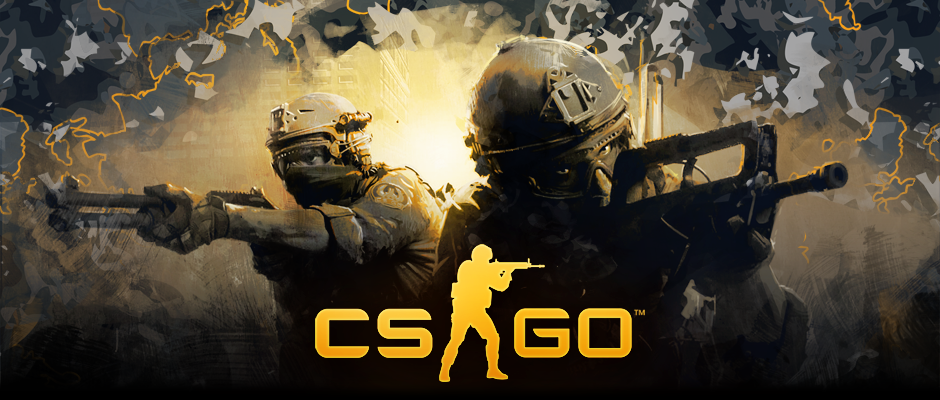

COUNTER-STRIKE: GLOBAL OFFENSIVE
================================

|

----

SUMMARY
================================
Counter-Strike: Global Offensive is a multiplayer first person shooter played on
PC. Players play as either terrorists, or counter-terrorists to fulfill missions
such as planting (or defusing) a bomb, or rescuing a hostage.

It is the newest edition in the Counter-Strike series, which began with the
original game in 1999, and also includes Counter-Strike 1.6 and Counter-Strike:
Source.

It is one of the popular competitive eSports titles played in tournaments. 

----

GAME MODES
================================

* Casual Game Modes
    - Bomb Scenario
    - Hostage Scenario
    - Arms Race
    - Demolition
    - Deathmatch
    
* Competitive Game Modes
    - Bomb Scenario
    - Hostage Scenario
    
----

CASUAL VS. COMPETITIVE
================================

* Casual:
    - Ten Players Per Team
    - Armor Granted Automatically
    - $10000 Money Cap
    
* Competitive
    - Five Players Per Team
    - Armor Must Be Purchased
    - $16000 Money Cap
    - Kills Worth 2X Casual
    
----

TERRORISTS
================================
.. image:: t.png
    :height: 100
    :align: center

Terrorists have the advantage of less expensive guns and fire grenandes, and
their guns often inflict more damage per shot than their good guy counterparts.

A disadvantage is that they have fewer weapons to choose from, and none of them
have silencers. 

----

COUNTER-TERRORISTS
================================

.. image:: ct.png
    :height: 100
    :align: center

Counter-Terrorists have the advantage of silenced guns, as well as having a
wider selection of guns overall. They also are more likely to have a tactical
advantage on many maps.

One of the disadvantages is having to purchase a defuse kit/hostage rescue kit,
which is an added cost every time you die.

----

COMPETITIVE PLAY
================================

Counter-Strike: Global Offensive is played competitively in tournaments all
over the world. 
